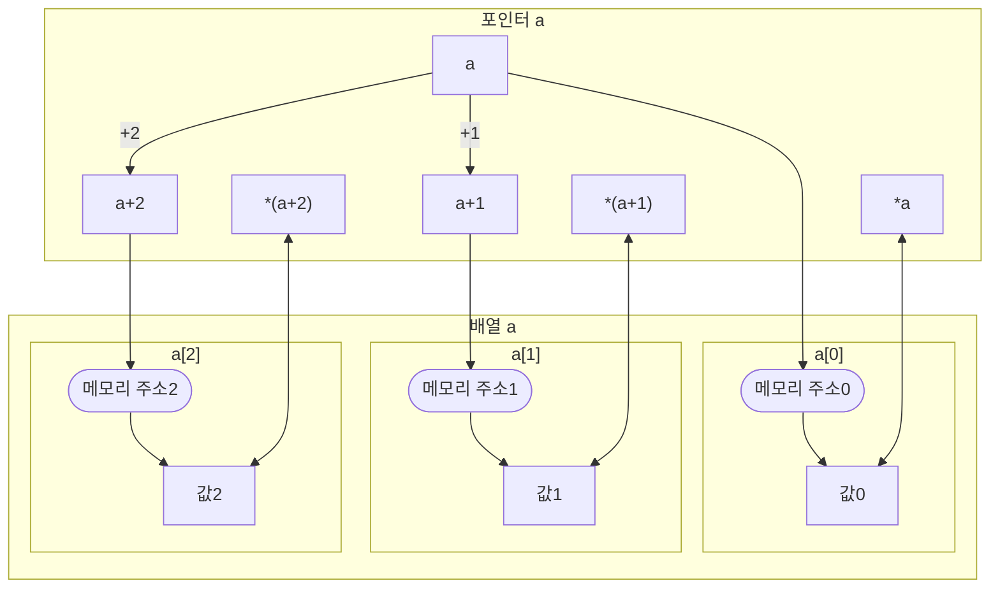

# 배열과 포인터

## 배열의 이름은 포인터

배열의 이름은 첫 번째 원소의 주소를 나타내는 포인터로 작동한다. 하지만 배열 이름 자체는 상수 포인터로, 다른 메모리를 가리키도록 변경할 수 없다.

배열 이름과 포인터 연산을 통해 인덱스를 사용하지 않고 배열의 값에 접근할 수 있다.

### 배열과 포인터 도식



## 반복문과 포인터

- 배열에 차례로 접근할 때 인덱스를 통해 접근하지 않고, 포인터 증감 연산을 통해 접근할 수 있다.
- `*(ptr++)` 와 같이 값을 읽고 포인터를 1 증가시키는 코드를 이용하여 차례로 배열의 값에 접근할 수 있다.

### 예시

```c
int a[5] = { 10,20,30,40,50 };
int* ptr = a;
// a를 int 형 포인터에 대입

for (int i = 0; i < 5; i++)
{
    printf("%d\n", *ptr++);
    // 차례로 주소를 증가하면서 역참조한다
};
```

```
10
20
30
40
50
```

## 포인터 사용의 장점

- **메모리 효율성**: 배열처럼 고정된 크기의 데이터 구조와 다르게, 동적 메모리 할당을 통해 필요한 만큼 메모리를 사용할 수 있다.
- **빠른 연산**: 포인터는 메모리 주소를 직접 다루므로, 반복문에서 인덱스 연산 없이 직접 메모리에 접근하여 성능을 향상시킬 수 있다.
- **다양한 활용 가능성**: 다차원 배열, 동적 메모리, 함수 인자로 배열을 전달하는 경우 포인터를 이용하면 코드의 유연성과 재사용성이 높아진다.