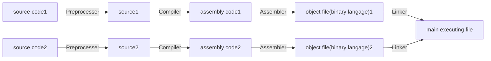

# C++ 기초

## C++의 컴파일 과정



## C++ Console Input/Output

```cpp
#include <iostream>
#include <cstdlib>

int main(void)
{
    int x, y;
    std::cout << "Please enter two numbers : ";
    std::cin >> x >> y;
    std::cout << "Their sum is : " << (x + y) << std::endl;
    return 0;
}
```
* Object-Oriented Programming 개념에 따른 콘솔 입출력 기능
* 콘솔 입출력 버퍼도 객체로 간주
* cin 스트림(객체)에서 >> 연산자로 string 으로 변환된 값을 변수에 대입
* cout 스트림(객체)에 << 연산자로 string 으로 변환된 값을 대입 후 콘솔창에서 출력
* Operator Overloading을 이용해 비트 shift연산자 <<, >>을 재정의하여 사용