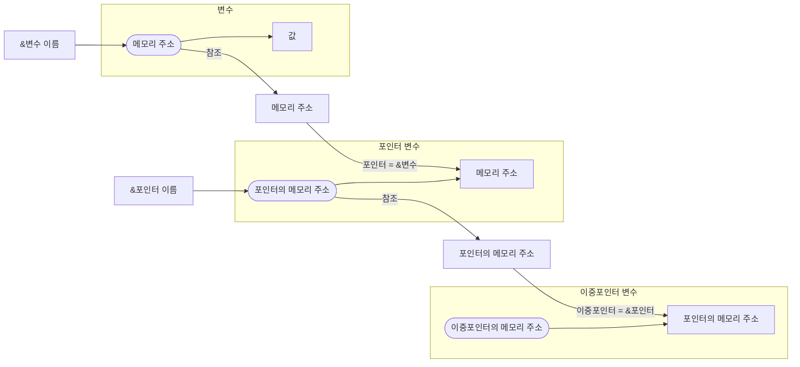
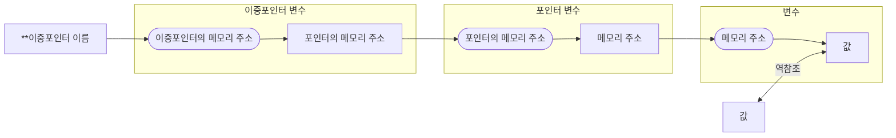

# 다중 포인터

다중 포인터(Multi-level Pointer)란 포인터의 포인터를 의미하며, 특정 메모리 주소를 저장하는 변수를 가리키는 또 다른 포인터이다. 다중 포인터를 사용하면 메모리의 여러 계층을 간접적으로 접근할 수 있다.

## 다중 포인터의 정의 및 선언

### 문법

```c
자료형 변수명 = 초기값;               // 변수
자료형* 포인터변수 = &변수;           // 변수의 주소를 가리키는 포인터
자료형** 이중포인터변수 = &포인터변수; // 포인터의 주소를 가리키는 포인터
...
```

- C 언어에서 포인터의 레벨(몇 중 포인터인지를 나타냄)은 `*` 의 개수로 결정된다.
- 각 `*` 는 포인터가 가리키는 대상이 또 다른 포인터임을 나타낸다.
- `*` 의 개수가 많아질수록 포인터 체인이 복잡해지고 관리가 어려워진다. 따라서 N중 포인터는 필요할 때만 사용해야 하며, 코드의 가독성을 높이는 것이 중요하다.

### 예시

```c
int x = 10;        // 정수형 변수
int* p = &x;       // x의 주소를 가리키는 포인터
int** pp = &p;     // p의 주소를 가리키는 포인터
int*** ppp = &pp;  // pp의 주소를 가리키는 포인터
...
```

## 다중 포인터의 역참조

### 문법

```c
**...*ptr
```

- C 언어에서 포인터의 `*` 개수는 참조의 레벨(데이터에 접근하기 위해 몇 단계를 거쳐야 하는지)을 결정한다.
- 따라서 `*`의 개수에 따라 역참조하는 레벨이 달라진다.
- 각각의 `*`은 포인터 체인을 따라 데이터를 참조하는 단계를 추가하는 역할을 한다.

### 예시

```c
int x = 10;        // 정수형 변수
int* p = &x;       // x의 주소를 가리키는 포인터
int** pp = &p;     // p의 주소를 가리키는 포인터

printf("%d\n", x);    // 10
printf("%d\n", *p);   // 10 (p가 가리키는 변수의 값)
printf("%d\n", **pp); // 10 (pp가 가리키는 포인터 p가 가리키는 값)
```

## Referencing/Dereferencing 도식

### 포인터와 포인터 변수


### 참조



### 역참조

