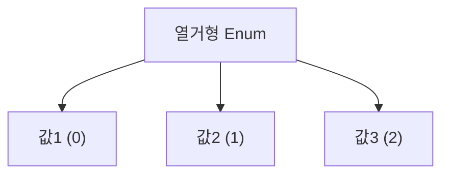

# 열거형

## 열거형이란

열거형(Enumeration)은 C++ 에서 관련된 상수들의 집합을 정의하는 데 사용되는 자료형이다. 코드의 가독성을 높이고 상수 집합을 명확히 정의할 수 있다.

### 열거형 개념

열거형은 `enum` 키워드를 사용하여 정의되며, 이름이 있는 상수 집합을 생성한다. 각 상수는 기본적으로 0부터 시작하여 순차적으로 증가하는 정수 값으로 표현된다. 필요에 따라 초기값을 지정하여 값을 변경할 수도 있다.

### 도식



## 열거형 문법

### 문법

```cpp
enum 열거형이름 
{
    상수1 = 값1,
    상수2 = 값2,
    상수3 = 값3
}
```

- `enum`: 열거형 정의를 나타내는 키워드.
- `열거형이름`: 열거형의 이름으로, 선택 사항이다.
- `상수`: 열거형에 정의된 각 항목의 이름.
- `값`: 각 상수에 할당된 정수 값(선택 사항, 기본값은 0부터 시작).

### 예시

```cpp
#include <iostream>
#include <cstdlib>

using namespace std;

enum Day
{
    Sunday,
    Monday,
    Tuesday,
    Wednesday,
    Thursday,
    Friday,
    Saturday
};

enum Mood
{
    Happy = 3,
    Sad = 1,
    Anxious = 4,
    Sleepy = 2
};

int main(void)
{
    Day today = Monday;
    Mood myMood = Sleepy;

    if (today == Monday)
        cout << "Today is Monday..." << endl;
    else if (today == Friday)
        cout << "Today is Friday!!" << endl;
    if (myMood == Sleepy)
        cout << "I want to go to sleep..." << endl;
    return 0;
}
```

```
Today is Monday...
I want to go to sleep...
```

## 이름 없는 열거형

이름 없는 열거형은 열거형의 이름을 지정하지 않고, 열거형 내부의 상수만을 정의하는 방식으로 사용된다.  이는 정수형 기호 상수를 선언하고 사용할 때 주로 활용된다. 

이름 없는 열거형을 사용하면, 열거형의 각 상수 이름만 코드에서 사용 가능하다. 이는 정수형 상수를 선언하는 간단한 방법으로 사용된다. 컴파일러가 자동으로 값을 관리하므로 수동 관리보다 실수를 줄일 수 있다.

### 문법

```cpp
enum 
{
    상수1 = 값1,
    상수2,
    상수3 = 값3
};
```

- **`enum`** 키워드 뒤에 이름을 지정하지 않는다.
- 열거형에 포함된 상수는 전역적으로 사용 가능하다.
- 각 상수는 기본적으로 0부터 시작하며, 명시적으로 값을 지정하면 그 이후는 해당 값을 기준으로 증가한다.

### 예시

```cpp
#include <iostream>
#include <cstdlib>

using namespace std;

enum
{
    RED = 1,
    GREEN,
    BLUE
};

int main(void)
{
    cout << "Red : " << RED << endl;
    cout << "Green : " << GREEN << endl;
    cout << "Blue : " << BLUE << endl;
    return 0;
}
```

```
RED: 1
GREEN: 2
BLUE: 3
```

## 이름 없는 열거형 활용

### 플래그 정의

```c
enum 
{
    FLAG_READ = 1 << 0,  // 0001
    FLAG_WRITE = 1 << 1, // 0010
    FLAG_EXECUTE = 1 << 2 // 0100
};
```

### 매직 넘버 제거

```c
enum
{
    ERROR_INVALID = -1,
    ERROR_NONE = 0,
    ERROR_TIMEOUT = 1
};
```