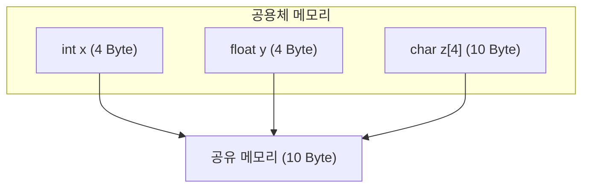

# 공용체

## 공용체란

공용체(Union)는 C 언어에서 하나의 메모리 공간을 공유하며, 다양한 데이터 형식을 저장할 수 있는 자료 구조이다. 공용체의 모든 멤버는 동일한 메모리 공간을 공유하며, 한 번에 하나의 멤버만 값을 가질 수 있다.

### 공용체 개념

- **메모리 공유**: 공용체의 모든 멤버는 동일한 메모리 공간을 사용하므로, 공용체의 크기는 가장 큰 멤버의 크기와 같다.
- **하나의 데이터만 저장**: 공용체는 여러 데이터 타입을 포함할 수 있지만, 동시에 하나의 데이터만 저장 가능하다.
- **효율성**: 메모리 사용을 최소화하려는 상황에서 유용하다.

### 도식



- 공용체의 모든 멤버가 동일한 메모리 공간을 공유한다.
- 공용체는 제일 큰 메모리의 크기만큼 할당받는다.

## 공용체 문법

### 문법

```c
union 태그
{
    자료형1 멤버1
    자료형2 멤버2
    ...
};
```

- 공용체는 `union` 키워드를 사용하여 선언한다.
- 구조체를 선언하는 문법과 유사하다.
- 구조체의 멤버의 자료형으로 공용체를 사용할 수 있다.
- 사용하는 과정에서 구조체와 동일하게 멤버 연산자를 이용해 자료형을 정한다.

### 예시

```c
#define _CRT_SECURE_NO_WARNINGS
#include <stdio.h>
#include <string.h>

union Value
{
    int stu_id;
    char reg_id[10];
};

struct Student 
{
    union Value id;
    double grade;
};

int main(void)
{
    struct Student s1;
    struct Student s2;

    s1.id.stu_id = 341;
    s1.grade = 4.5;

    strcpy(s2.id.reg_id, "1231");
    s2.grade = 3.2;

    printf("%d %.1lf\n", s1.id.stu_id, s1.grade);
    printf("%s %.1lf\n", s2.id.reg_id, s2.grade);

    return 0;
}
```

```
341 4.5
1231 3.2
```