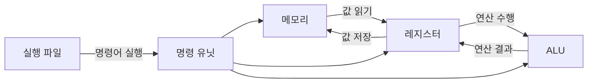

# 변수와 상수

## 변수란 무엇인가?

프로그램이 실행될 때, 필요한 값을 편리하게 사용하려면 컴퓨터의 메인 메모리에 공간을 확보하여 데이터를 저장하고, 이를 다시 불러와 사용할 수 있어야 한다. 이를 위해 변수가 사용된다.

컴파일러는 소스 코드를 분석하여 실행 파일을 생성하는 과정에서, 변수 선언문을 확인하고 변수에 대한 메모리 주소를 자동으로 할당한다. 

대입 연산자를 사용해 값을 변수에 저장하면, 해당 값은 변수와 연결된 메모리 주소에 저장된다. 이후, 변수를 사용하는 코드가 실행되면 컴파일러는 해당 메모리 주소의 값을 읽어오는 명령어를 실행 파일에 포함 시킨다.

이러한 과정에서 변수 이름은 메모리 주소를 참조하기 위한 "별칭" 역할만 하므로, 변수 이름의 길이는 실행 파일의 크기에 아무런 영향을 미치지 않는다. 

프로그래머는 메모리 주소를 직접 다룰 필요 없이 변수 이름을 통해 메모리를 효율적으로 관리할 수 있다. 이 모든 과정은 컴파일러가 자동으로 처리하므로, 프로그래머는 보다 간단하고 편리하게 코드를 작성할 수 있다.

### 다음은 변수의 작동 과정을 정리한 내용이다:

1. **프로그램 실행 준비 (컴파일 단계)**
    - 컴파일러는 소스 코드를 분석하며, 변수 선언문을 확인한다.
    - 변수에 대한 메모리 크기와 배치를 계산하여 변수에 할당될 메모리 주소를 참조하는 명령어를 생성한다.
    - 대입 연산이 포함된 코드에서는 값을  해당 변수의 메모리에 저장하는 명령어를 삽입한다.
    - 값 읽기가 포함된 코드에서는 해당 변수의 메모리 주소에서 값을 읽는 명령어를 실행 파일에 삽입한다.
2. **실행 파일 생성**
    - 컴파일 결과, 실행 파일에는 변수를 위한 메모리 관리와 관련된 명령어가 포함된다.
    - 변수 이름은 실행 파일 내부에서 메모리 주소에 대응된다.
    - 실행 파일에서는 변수 이름이 사용되지 않는다.
3. **프로그램 실행 (실행 단계)**
    - 프로그램이 실행되면 운영 체제가 실행 파일을 메모리에 로드 한다.
    - 실행 파일에 따라 변수에 대한 메모리 주소를 실제 메인 메모리에서 할당한다.
    - 프로그램은 실행 파일에 포함된 명령어를 따라 변수에 값을 저장하거나, 저장된 값을 메모리 주소에서 읽어온다.
4. **프로그램 종료 시 메모리 관리**
    - 지역 변수는 함수 호출이 끝날 때 스택 메모리에서 해제된다.
    - 동적 메모리의 경우 `free()` 등을 사용하지 않으면 메모리가 해제되지 않아 누수(memory leak)가 발생할 수 있다.
    - 전역 변수와 정적 변수는 프로그램이 종료될 때 운영 체제가 메모리를 회수한다.

## 변수 선언

### 자료형 정의

- 변수 선언의 첫 단계는 자료형을 정의하는 것이다.
- 자료형은 변수에 저장될 값의 종류(정수, 실수, 문자 등)와 크기를 결정한다.
- `int`, `float`, `char`.

### 변수 이름 지정

- 변수 이름은 메모리를 참조할 때 사용하는 별칭으로, 메모리 주소와 연결된다.
- 이름은 유효한 식별자여야 하며, 프로그램 내에서 고유해야 한다.

### 변수 선언 문법

```cpp
자료형 변수이름 [= 초기값];
```

1. **자료형:** 변수에 저장될 값의 종류를 정의한다.예: `int`, `float`, `char`, `double`, `long` 등.
2. **변수이름:** 변수를 참조하기 위한 고유한 이름(식별자).
3. **초기값 (선택사항):**
    - 변수 선언 시 값을 할당할 수 있다.
    - 초기값을 지정하지 않으면 쓰레기 값(Garbage Value)을 가진다.

## 변수의 구성 요소

### 1. 자료형 (Data Type)

- 변수의 자료형은 변수에 저장할 데이터의 종류, 크기, 값의 범위를 정의한다.
- 컴파일러는 변수의 자료형에 따라 실행 파일을 작성 할 때 메모리 할당과 연산 방식을 결정한다.
- 기본 자료형은 정수형, 부동 소수점형, 문자형이 있다.

### 2. 변수의 메모리 주소

- 컴파일러가 할당한 메모리가 저장될 주소이다.
- 변수에 할당된 메모리의 의 시작 주소가 변수의 주소로 지정된다.
- 컴파일러는 실행 파일을 생성할 때 변수 값을 저장하거나 읽는 명령어를 삽입하며, 이 명령어는 변수의 주소를 참조하여 작동한다.
- 프로그래머는 포인터를 사용하여 변수의 주소를 확인하거나, 해당 메모리를 직접 조작하고 참조할 수 있다.
- `&` 연산자는 변수의 주소를 반환한다.

```cpp
int number = 100; 
// 정수형 변수 num 선언
// 100 으로 초기화
int* numAddress = &number; 
// 정수형 포인터 변수 numAddress 선언
// number의 주소로 초기화

cout << number << endl;
cout << numAddress << endl;
//100
//000000B8C714F5D4
```

### 3. 실제 메모리 (값이 저장되는 공간)

- 변수는 컴퓨터의 메인 메모리에 저장된다
- 변수의 자료형(Data Type)에 따라 값이 저장되는 메모리 크기가 다르다.
- 1 Byte는 8 bit로 구성되며, 이는 8개의 이진수로 정보를 저장한다는 뜻이다.

### 4. 저장된 값

- 변수에 실제로 저장된 값이다.
- 변수에 저장된 값은 메모리 내에서 이진수(Binary Format)로 저장되어 있다.
- 실행 파일에서 메모리를 참조하여 값을 읽는 명령어가 실행되면, 해당 값은 레지스터에 로드되고, 이후 ALU에서 연산이 수행된 결과가 다시 레지스터에 저장된다..
- 실행 파일에서, 레지스터에 저장된 연산 결과를 메모리 주소를 참조하여 값을 저장하는 명령어가 실행되면, 해당 메모리 위치에 그 값이 저장된다.
- 변수를 선언하고 초기화를 하기 전에는 메모리의 주소만 있고 저장된 값이 없기 때문에 의미 없는 쓰레기 값이 들어있다.



## 변수와 상수

- **변수와 상수의 공통점**
    - 변수와 상수는 모두 **메모리**에 저장된다.
    - 프로그램 실행 중 데이터를 저장하고 참조하기 위한 메모리 공간을 차지한다.
- **변수와 상수의 차이점**
    - **변수**: 대입 연산 등을 통해 저장된 값을 **변경**할 수 있다.
    - **상수**: 변수와 동일하게 메모리에 저장되지만, 값을 **변경할 수 없도록** 태그가 붙어 있다. 즉, **읽기 전용** 데이터로 동작한다.
- **리터럴 상수 (Literal Constant)**
    - **이름이 없는 상수**를 의미한다.
    - 코드에서 직접적으로 값이 사용되며, 특정 이름으로 참조되지 않는다.
    - 숫자 `42`, 소수점 값 `3.14`, 문자 `'A'` 등.
- **기호 상수 (Symbolic Constant)**
    - 상수에 이름을 붙여 사용하는 것을 의미한다.
    - **`#define` 지시어** 또는 **`const` 키워드**를 사용하여 선언한다.
    - 기호 상수는 코드 가독성을 높이고 유지보수를 용이하게 한다.

### 리터럴 상수와 컴파일러

일반적인 C 컴파일러는 중복 저장을 피하기 위한 최적화 기능을 제공한다. 이러한 최적화는 컴파일러의 구현 방식에 따라 다르지만, 대부분의 현대 컴파일러는 리터럴 상수에 대해 중복된 메모리 사용을 최소화하려는 노력을 한다.

1. **문자열 리터럴의 경우**
    - 대부분의 C 컴파일러(GCC, Clang 등)는 동일한 문자열 리터럴이 여러 번 등장하면 프로그램의 데이터 영역(data segment)에 한 번만 저장하고, 이를 참조하도록 최적화한다.
    - 이 최적화는 문자열 상수 풀(String Literal Pooling)이라고 불린다.
2. **숫자 리터럴의 경우**
    - 숫자 리터럴(정수, 실수)은 문자열과는 다르게 최적화되지 않는 경우가 많다.
    - 컴파일러는 숫자 리터럴을 직접 기계어 코드에 포함하거나, 필요할 때 계산 결과를 저장하는 방식을 사용한다.
    - 따라서, 동일한 숫자 리터럴이 반복되더라도 메모리에서 중복 저장을 피하지 못할 가능성이 있다.
3. **기호 상수와 메모리 관리**
    - 기호 상수를 사용하는 것은 중복 저장 문제를 해결하는 가장 확실한 방법이다.
    - `#define` 또는 `const`를 활용하면, 코드에서 동일한 값을 참조하면서도 메모리 낭비를 줄일 수 있다.

## 기호 상수

기호 상수는 **변하지 않는 값**에 이름을 붙여 사용하는 방식으로, 프로그램의 가독성을 높이고 유지보수를 용이하게 한다. C 언어에서는 기호 상수를 선언하는 데 주로 **전처리기** 또는 **`const` 키워드**를 사용한다.

### 1. 전처리기 사용

- **특징**
    - 전처리기 지시어 `#define`을 사용하여 상수를 정의한다.
    - 전처리기는 컴파일 전에 코드에서 상수를 값으로 대체한다.
    - 타입을 지정하지 않으며, 특정 타입 검사를 하지 않는다.
- **문법**
    
    ```c
    #define 상수이름 값
    ```
    
- **예제**
    
    ```cpp
    #define PI 3.14159
    #define MAX_VALUE 100
    
    printf("PI: %.2f\n", PI);
    printf("Max Value: %d\n", MAX_VALUE);
    // PI: 3.14
    // Max Value : 100
    ```
    
- **장점**
    1. 간단하게 선언 가능.
    2. 여러 곳에서 반복되는 값을 한 번에 관리할 수 있음.
- **단점**
    1. 데이터 타입을 명시하지 않으므로, 의도하지 않은 타입 사용으로 오류가 발생할 수 있음.
    2. 디버깅 시 상수 이름 대신 값이 표시되므로 코드 추적이 어려움.

### 2. `const` 키워드 사용

- **특징**
    - `const` 키워드를 사용하여 변수의 값을 변경할 수 없도록 선언한다.
    - 컴파일러가 **타입 검사를 수행**하므로, 데이터 타입에 맞는 상수를 선언할 수 있다.
- **문법**
    
    ```c
    const 자료형 상수이름 = 값;
    ```
    
- **예제**
    
    ```cpp
    const double PI = 3.14159;
    const int MAX_VALUE = 100;
    
    printf("PI: %.2f\n", PI);
    printf("Max Value: %d\n", MAX_VALUE);
    // PI: 3.14
    // Max Value : 100
    ```
    
- **장점**
    1. 데이터 타입이 명확하므로, 타입 안전성을 보장.
    2. 디버깅 시 상수 이름이 유지되므로 코드 추적이 쉬움.
    3. 메모리 내에서 읽기 전용으로 처리되어 의도치 않은 값 변경을 방지.
- **단점**
    1. 선언 방식이 전처리기에 비해 다소 복잡.
    2. 상수의 이름을 전역으로 관리하려면 추가 작업이 필요.

### 3. 전처리기와 `const` 키워드 비교

| **특징** | **전처리기 사용 (`#define`)** | **`const` 키워드 사용** |
| --- | --- | --- |
| **타입 지정 여부** | 없음 | 있음 |
| **타입 안전성** | 낮음 | 높음 |
| **컴파일 단계** | 컴파일 전 | 컴파일 중 |
| **값 변경 가능 여부** | 불가능 | 불가능 |
| **디버깅 용이성** | 낮음 | 높음 |