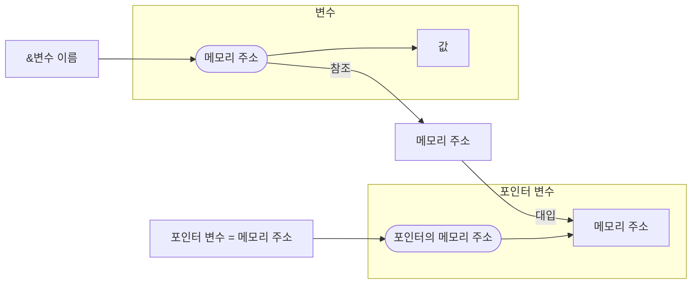
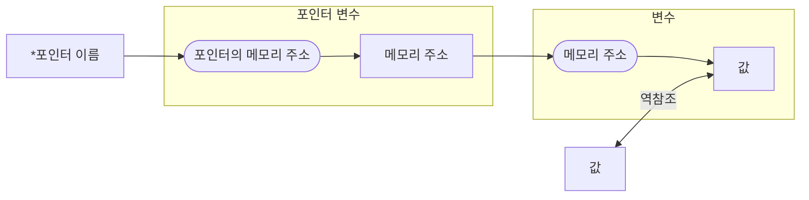

# 참조와 역참조

## Referencing (참조)

참조는 변수의 주소를 가져오는 것을 의미한다. 

참조를 통해 변수의 메모리 주소를 확인하거나, 해당 주소를 포인터 변수에 저장할 수 있다.

### 참조 연산자 `&`

참조 연산자 `&`는 변수의 메모리 주소를 반환하는 연산자이다. 

이를 통해 변수의 메모리 주소를 읽고 이용할 수 있디.

### 참조 연산 문법

```c
&변수이름
```

- 변수 이름 앞에 `&` 를 붙인 형태.
- 변수의 주소를 반환.
- 상수에는 사용할 수 없다.

### 참조 연산 예시

```c
int A = 10;
int B = 20;

printf("Address: %p, Value: %d\n", &A, A);
// A의 주소를 참조 후 값을 출력
printf("Address: %p, Value: %d\n", &B, B);
// B의 주소를 참조 후 값을 출력
```

```
// 실행 1
Address: 00000097BD76F504, Value: 10
Address: 00000097BD76F524, Value: 20

// 실행 2
Address: 000000E4E62FF644, Value: 10
Address: 000000E4E62FF664, Value: 20
```

- 변수의 주소를 반환하여 출력한다.
- 메모리의 주소는 파일이 실행될 때 운영체제에서 임의로 주소를 할당하기 때문에 실행할 때마다 다른 주소를 가진다.

## Dereferencing (역참조)

역참조는 포인터가 가리키는 메모리 주소에 저장된 값을 읽거나 변경하는 것을 의미한다.

### 역참조 연산자 `*`

역참조 연산자 `*`는 포인터가 가리키는 메모리 주소에 저장된 값을 참조하는 데 사용된다.

포인터 변수는 메모리 주소를 저장하며, 이 주소를 통해 변수의 값을 간접적으로 참조하거나 변경할 수 있다. `*` 연산자는 포인터가 가리키는 주소의 값을 접근할 때 사용한다.

### 역참조 연산 문법

```c
*포인터이름
```

- 포인터 이름 앞에 `&` 를 붙인 형태.
- 변수의 주소에 저장된 값에 접근 혹은 반환.
- 포인터가 가리키는 주소의 값을 반환하거나, 변경할 때 사용된다.

### 역참조 연산 예시

```c
int x = 10;
// 변수 x 선언
// 10 대입
int* ptrx = &x;
// 포인터 변수 선언
// x의 주소 참조 후 대입

printf("Address: %p\n", ptrx);
// x의 주소 출력
printf("Value: %d\n", *ptrx);
// 포인터 변수를 역참조
// int* 형 변수이므로 주소를 통해 값을 역참조하여 int 형으로 읽음

*ptrx = 20;
// 포인터 변수를 역참조하여 값을 주소에 대입
// int 형으로 값을 대입
printf("Updated Value: %d\n", x);
// 변경된 값 출력
```

```
Address: 00000021980FF8B4
Value: 10
Updated Value: 20
```

## Referencing/Dereferencing 도식

### 포인터와 포인터 변수


- 포인터와 포인터 변수가 메모리에 저장되어 있는 모습이다.
- 변수와 포인터 변수 모두 값과 주소를 가지는 변수이다.
- 포인터 변수에는 변수의 메모리 주소가 값으로 들어 있다.

### 참조



- 컴파일러가 변수 이름을 읽고 해당 변수의 주소를 반환하여 실행 파일을 만들 때 이용.
- 포인터 변수에 이를 대입하는 코드가 있으면 해당 포인터 변수에 할당된 메모리 주소에 값을 저장.

### 역참조



- 포인터와 포인터 변수가 메모리에 저장되어 있는 모습이다.
- 변수와 포인터 변수 모두 값과 주소를 가지는 변수이다.
- 결론적으로 포인터 이름을 통해 해당 주소에 저장되어 있는 값에 접근.