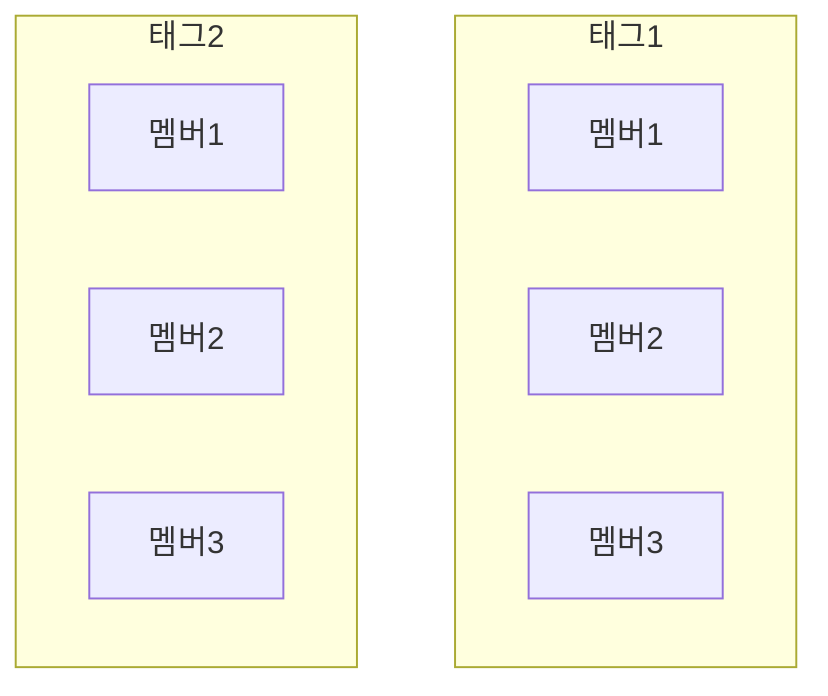
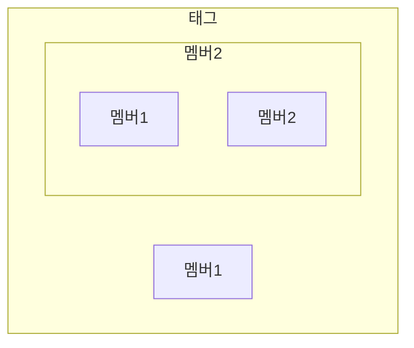

# 구조체란

구조체(structure)는 C 언어에서 서로 다른 자료형의 데이터를 하나로 묶어 관리할 수 있도록 지원하는 사용자 정의 데이터 형식이다. 

구조체는 멤버라 불리는 여러 변수를 포함하며, 이 멤버들은 각각 독립적인 데이터 저장 공간을 가지면서도 구조체라는 하나의 단위로 취급된다. 

이를 통해 복잡한 데이터를 체계적으로 관리할 수 있으며, 코드의 가독성과 유지보수성을 높이는 데 유용하다. 

## 구조체 용어

### 멤버(member)

- 구조체 내의 개별적인 변수를 멤버라고 한다.
- 멤버는 구조체 안에서 데이터를 저장하거나 조작할 수 있는 기본적인 단위이다.
- 서로 다른 자료형이 가능하다.

### 태그(tag)

- 구조체의 이름을 태그라고한다.
- 태그를 통해 구조체들을 서로 구별한다.

### 도식



## 구조체 문법

### 선언

```c
struct 태그1 
{
    자료형 멤버1;
    자료형 멤버2;
    자료형 멤버3;
    ...
};

struct 태그2 
{
    자료형 멤버1;
    ...
};
```

### 변수 선언

```c
struct 태그 변수명;
```

### 이름없는 구조체

```c
struct
{
    자료형 멤버1;
    자료형 멤버2;
    자료형 멤버3;
    ...
} 변수명1, 변수명2, ... ;
```

- 이름 없이 정의된 구조체를 이름 없는 구조체라고 한다.
- 이는 임시 데이터 구조가 필요하거나, 한 번만 사용될 때 주로 사용된다.
- 구조체에 이름이 없기 때문에 선언 이후에 변수를 만들 수 없다.

### 멤버 연산자

```c
변수명.멤버명;
```

- 구조체 변수의 멤버에 접근할 때 `.` 연산자를 사용한다.
- 멤버에 접근하여 값을 대입하거나 사용할 수 있다.

### 예시

```c
#define _CRT_SECURE_NO_WARNINGS
#include <stdio.h>

struct student
{
	int id;
	double grade;
};
// student 구조체 선언
// 2개의 멤버를 가지고 있음

struct
{
	double mean;
	double max;
	double min;
} group1, group2;
// 이름없는 구조체 선언
// 3개의 멤버를 가지고 있음
// 2개의 변수 선언
// 이 변수명만 사용 가능하다

int main(void)
{
	struct student s1;
	// student 구조체 변수 s1 선언

	s1.id = 1;
	s1.grade = 4.5;
	// 각 멤버에 값 대입

	struct student s2;
	// student 구조체 변수 s2 선언

	s2.id = 2;
	s2.grade = 4.23;
	// 각 멤버에 값 대입

	printf("%d %.3lf\n", s1.id, s1.grade);
	printf("%d %.3lf\n", s2.id, s2.grade);

	group1.mean = 3.1;
	group1.max = 4.5;
	group1.min = 2.0;
	// group1의 각 멤버에 값 대입
	// 이 구조체에는 이름이 없음

	group2.mean = 3.2;
	group2.max = 4.5;
	group2.min = 2.3;
	// group2의 각 멤버에 값 대입
	// 이 구조체에는 이름이 없음

	printf("%.3lf %.3lf %.3lf\n", group1.mean, group1.max, group1.min);
	printf("%.3lf %.3lf %.3lf\n", group2.mean, group2.max, group2.min);

	return 0;
}
```

```
1 4.500
2 4.230
3.100 4.500 2.000
3.200 4.500 2.300
```

## 구조체 초기화

### 문법

```c
struct 구조체명 변수명 = {값1, 값2, ...};
변수명 = {값1, 값2, ...};
```

- 구조체를 초기화할 때는 중괄호 `{}` 안에 각 멤버의 값을 선언 순서대로 지정한다.
- `{}` 안에 각 멤버의 값을 순서대로 적어서 한번에 대입할 수도 있다.

### 예시

```c
struct point
{
	int x;
	int y;
};

struct point p1 = { 1,2 };
// 기본적인 초기화 방법
// x = 1
// y = 2

struct point p2 = p1;
// p2를 p1과 동일한 값으로 초기화
// x = 1
// y = 2

p2 = { 2,3 };
// 중괄호를 이용하여 한번에 대입
// x = 1
// y = 2
```

## 중첩 구조체

### 문법

```c
struct 내부구조체태그 {
    자료형 멤버1;
    자료형 멤버2;
    ...
};

struct 외부구조체태그 {
    자료형 멤버1;
    struct 내부구조체명 멤버2;
    ...
};
```

- **내부구조체명**: 외부 구조체의 멤버로 포함될 구조체.
- **외부구조체명**: 내부 구조체를 포함하는 구조체.

### 도식



### 예시

```c
#define _CRT_SECURE_NO_WARNINGS
#include <stdio.h>

struct student
{
	int id;
	double grade;
};
// student 구조체 선언
// 2개의 멤버를 가지고 있음

struct total
{
	double mean;
	struct student std;
};
// 이름없는 구조체 선언
// 2개의 멤버를 가지고 있음
// 멤버 중 하나는 구조체 변수

int main(void)
{
	struct total t1 = { 3.1, {12, 4.5} };
	// {}을 이용하여 초기화
	// {}내부의 구조체도 {}을 통하여 초기화한다.

	printf("%.1lf\n%d\n%.1lf\n", t1.mean, t1.std.id, t1.std.grade);
	// 값 출력

	return 0;
}
```

```
3.1
12
4.5
```